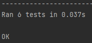

[](https://github.com/leonardosblang/c214_mock_github_actions/actions/workflows/python-package.yml)


# Testing, building and sending emails with github actions

Para rodar use o seguinte comando na pasta principal:

   ```bash
   python -m unittest 

   ```
<p align="center">
  
</p>
